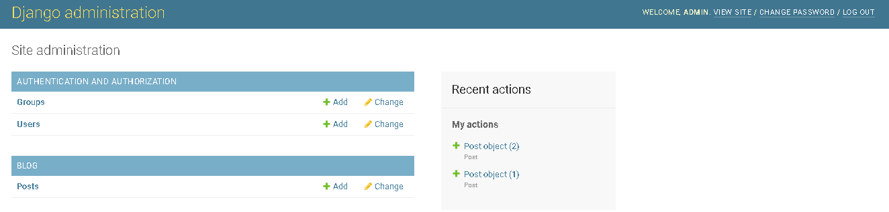
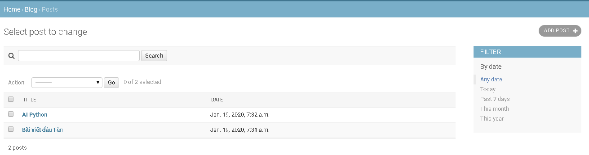
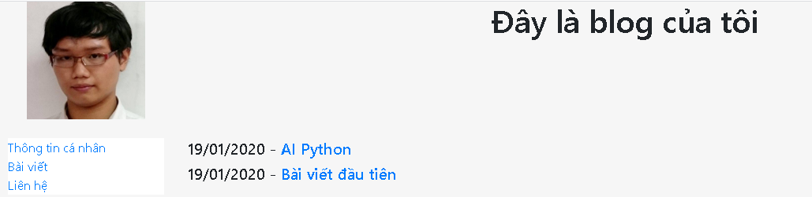
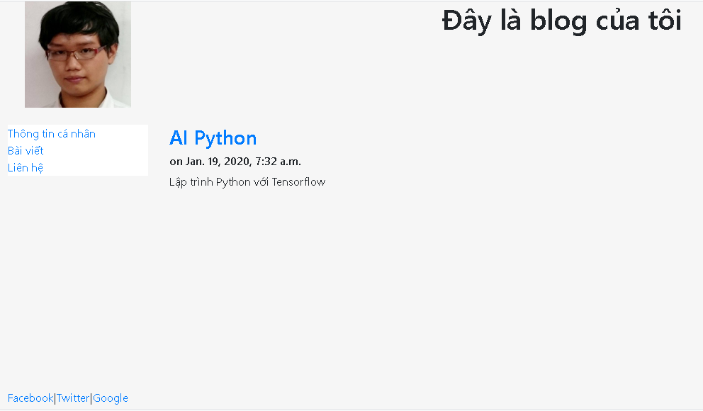
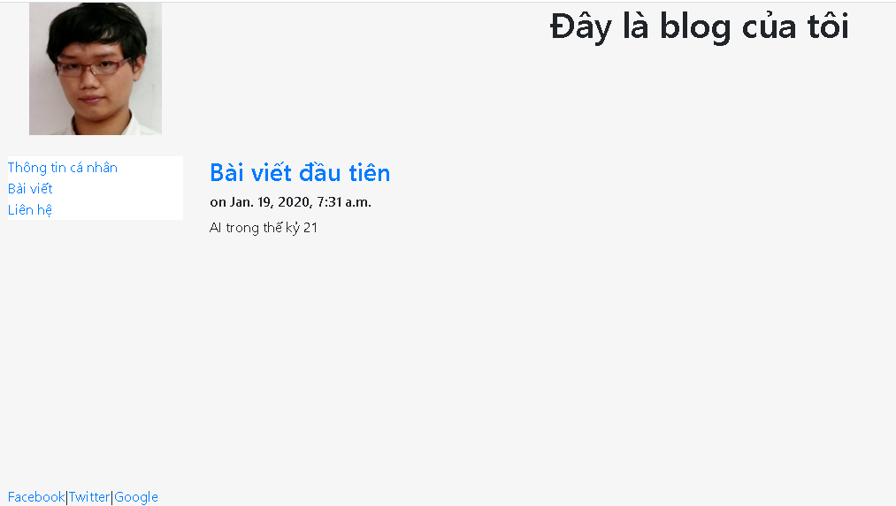

# Django

 Framework sử dụng mô hình MTV (Model-Template-View) nhưng cơ bản của nó là từ mô hình MVC (model-view-controller) 

_Lưu ý: Django trong project này là Django 3_

## Cài đặt
### Trên Windows 
+ Cài Python 3.7
+ `pip install django`
+ Tạo project đầu tiên: `django-admin startproject mywebsite .`
## Tạo ứng dụng:
+ `python manage.py startapp home`
+ Khai báo ứng dụng home cho project tại file settings.py:
  
  ```py
  INSTALLED_APPS = [
    'django.contrib.admin',
    'django.contrib.auth',
    'django.contrib.contenttypes',
    'django.contrib.sessions',
    'django.contrib.messages',
    'django.contrib.staticfiles',
    'home'
  ]
  ```
 
 + Cập nhật project: `python manage.py migrate`
 + Viết chương trình ứng dụng home đầu tiên:
    + Trong file views.py:
    
    ```py
    from django.shortcuts import render
    from django.http import HttpResponse

    def index(response):
        response = HttpResponse()
        response.writelines("<h1>Xin chào</h1>")
        response.write("<h2>Đây là app home</h2>")
        return response
    ```
    
    + Trong file urls.py:
    
    ```py
      from django.urls import path
      from . import views

      urlpatterns = [
        path('', views.index)
      ]
    ```
    
    + Trong file tests.py:
    
    ```py
    from django.test import TestCase, SimpleTestCase
    class SimpleTest(SimpleTestCase)
      def test_home_status(self)
        response = self.client.get('/home')
        self.assertEqual(response.status_code, 200)
    ```
    
    + Trong file mywebsite/urls.py 
    
    ```py
    from django.contrib import admin
    from django.urls import path, include
    
    urlpatterns = [
      path('admin/', admin.site.urls),
      path('home/', include('home.urls'))
    ]
    ```
    
    ## Tạo template:
    Mục đích tạo template trong Django là để tái sử dụng giao diện nhiều lần trong project và ứng dụng
    
	Ví dụ: 
	
    Trong thư mục home tạo:
    + templates/pages/base.html: Ý ở đây là template nền tảng
    
      ```html
      <!DOCTYPE html>
      <html>
          <head>
              <meta charset="UTF-8">
              <meta name="viewport" content="width=device-width, initial-scale=1.0">
              <meta http-equiv="X-UA-Compatible" content="ie=edge">
              <title> </title>
          </head>
          <body>
          Content:

          
          
          </body>
      </html>
      ```
+ templates/pages/home.html: Ở đây, home.html được kế thừa từ template base.html:

  ```html
    

    Home

     
        <h1>Xin chào</h1>
        <h2>Đây là app home</h2>
    
  ```
+ File views.py viết:

  ```py
  from django.shortcuts import render
  from django.http import HttpResponse
  
  def index(request):
    return render(request, 'pages/home.html')
  ```
  
+ Chạy project: `python manage.py runserver`

### Tạo Blog
+ Tạo app mới: `python manage.py startapp blog`
+ Cập nhật file settings.py tại dòng lệnh INSTALLED_APPS:

	```py
		INSTALLED_APPS = [
		'django.contrib.admin',
		'django.contrib.auth',
		'django.contrib.contenttypes',
		'django.contrib.sessions',
		'django.contrib.messages',
		'django.contrib.staticfiles',
		'home', 
		'blog',
	]
	```
+ Cập nhật lại project: `python manage.py migrate`
#### Tạo model

+ Trong file models.py của app blog tạo model database:

	```py
	from Django.db import models
	class Post(models.Model):
		title 	= models.CharField(max_length=100)
		content = models.TextField()
		date    = models.DateTimeField(auto_now_add=True)
	```

+ Cập nhật ứng dụng blog sau khi tạo xong model: `python manage.py makemigrations blog`
+ Cập nhật lại project sau khi cập nhật xong ứng dụng: `python manage.py migrate`
+ Xem và kiểm tra cơ sở dữ liệu sau khi cập nhật xong project. Ở đây mình dùng SQLite DB

#### Lưu trữ file metadata trong thư mục static trên môi trường product

Sử dụng static file

```

...
<link rel="stylesheet" href="">
```

Nếu chạy sản phẩm demo trên máy local thì chỉ cần chạy dòng lệnh sau đây là có thể gọi static thoải mái: `python manage.py runserver --insecure` 

Trên môi trường product như: Heroku, AWS, Openshift, PaaS,... nếu chỉ đơn thuần gọi cú pháp sử dụng
các file static thì chương trình sẽ không tìm thấy các file hình ảnh, video, css, js,... Vì vậy, để giải quyết vấn đề đó thì có một giải pháp là cài thêm gói `whitenoise` và cấu hình file settings.py

```
pip install whitenoise
```

Cấu hình trong file settings.py thì có thể tham khảo như sau:

```py
MIDDLEWARE = [
    'whitenoise.middleware.WhiteNoiseMiddleware',
    ...
]

STATICFILES_STORAGE = 'whitenoise.storage.CompressedStaticFilesStorage'
STATIC_URL = '/static/'
STATIC_ROOT = os.path.join(BASE_DIR, 'home/static')
STATICFILES_DIRS = (
    os.path.join(BASE_DIR, 'static'),
)
```

#### Tương tác với Cơ sở dữ liệu trong Django
+ Chạy dòng lệnh sau để tương tác với CSDL: `python manage.py shell`

+ Gọi đối tượng model đã tạo trong app ra tương tác với DB:

  ```py
  >>> from blog.models import Post
  >>> p = Post()
  >>> p.title = "Bài viết đầu tiên"
  >>> p.content = "AI trong thế kỷ 21"
  >>> p.save()
  >>> Post.objects.all()
  >>> p =Post.objects.get(id=1)
  >>> p.title
  >>> p.content 
  >>> p.date
  >>> p = Post(title = "AI Python", content = "Lập trình Python với Tensorflow")
  >>> p.save()
  >>> Post.objects.all()
  ```

  #### Thiết kế hệ thống admin blog 
  Mục đích: Quản lý user, group, hệ thống bài viết cho blog

  + Tạo user, pass đăng nhập hệ thống admin của blog: `python manage.py createsuperuser`
  + Chạy project: `python manage.py runserver`
  + Truy cập trang admin: [http://localhost:8000/admin](http://localhost:8000/admin) và đăng nhập hệ thống
  + Tạo chức năng quản trị bài viết:

    Trong file admin.py của ứng dụng blog đã tạo trước viết mã:

    ```py
    from django.contrib import admin
    from .models import Post

    class PostAdmin(admin.ModelAdmin):
      list_display  = ['title', 'date']
      list_filter   = ['date']
      search_fields = ['title']
    admin.site.register(Post, PostAdmin)
    ``` 

    + title, date là những thuộc tính trong model Post đã tạo trên
  + Kết quả:

    

    

  #### Liệt kê danh sách bài viết và hiển thị chi tiết bài viết
    + Tạo model DB cho bài viết:

    ```py
    from django.db import models
    class Post(models.Model):
        title   = models.CharField(max_length=100)
        content = models.TextField()
        date    = models.DateTimeField(auto_now_add=True)
        def __str__(self):
            return self.title
    ```
    + Trong file blog/views.py viết hai hàm hiển thị danh sách bài viết list và chi tiết bài viết post:

    ```py
    from django.shortcuts import render
    from .models import Post

    def list(request):
        data = {'Posts': Post.objects.all().order_by("-date")}
        return render(request, 'blog/blog.html', data)

    def post(request, id):
        post = Post.objects.get(id=id)
        return render(request, 'blog/post.html', {'post' : post})
    ```

  + Tạo template bài viết: Tạo thư mục templates/blog chứa hai file template html: blog.html, post.html

    Hai template này sẽ hiển thị dữ liệu render từ view

    + blog.html

    ```html
    
    Blog Display
    
      
            <h5>{{post.date|date:"d/m/Y"}} - <a href="/blog/{{post.id}}">{{post.title}}</a></h5>
      
    
    ```

    + post.html

    ```html
    
    {{post.title}}
    
      <h3><a href="blog/{{post.id}}">{{post.title}}</a></h3>
      <h6>on {{post.date}}</h6>
      {{post.content|safe|linebreaks}}
    
    ```
  + Cấu hình URL trong urls.py của ứng dụng blog

  ```py
  from django.urls import path
  from . import views

  urlpatterns = [
      path('', views.list),
      path('<int:id>/', views.post)
  ]
  ```
  + Cấu hình URL trong urls.py của project

  ```py
  from django.contrib import admin
  from django.urls import path, include

  urlpatterns = [
      path('admin/', admin.site.urls),
      path('', include('home.urls')),
      path('blog/', include('blog.urls'))
  ]
  ```

  + Viết Test case kiểm thử hai chức năng trên của blog:

  ```py
  from django.test import TestCase
  from .models import Post

  class BlogTest(TestCase):
      def setUp(self):
          Post.objects.create(
              title="My Title",
              content="This is a just test"
          )
      def test_string_representation(self):
          post = Post(title="My entry title")
          self.assertEqual(str(post), post.title)
      def test_post_list_view(self):
          response = self.client.get("/blog/")
          self.assertEqual(response.status_code, 200)
          self.assertContains(response, 'My Title')
          self.assertTemplateUsed(response, 'blog/blog.html')
      def test_post_detail_view(self):
          response = self.client.get("/blog/1/")
          self.assertEqual(response.status_code, 200)
          self.assertContains(response, 'My Title')
          self.assertTemplateUsed(response, 'blog/post.html')
  ```

  + Kết quả:

  

  

  

  #### Hardcode URL trong Django 
  Hardcoce là bất cứ những gì được gán cố định đối với những có thể sẽ thay đổi trong quá trình phát triển của phần mềm với mục đích nào đó.

  VD: Đường dẫn URL: http://localhost:8000/blog/1, http://localhost:8000/java/spring-mvc/1, http://localhost:8000/categories/network/1,...

  + Loại bỏ hardcode trong lập trình web Django:
    + Thêm thuộc tính name trong mảng urlpatterns trong file urls.py của ứng dụng blog

    ```py
    from django.urls import path
    from . import views

    urlpatterns = [
        path('', views.list, name="blog"),
        path('<int:id>/', views.post, name = "post")
    ]
    ```

    + Gọi đường dẫn với cú pháp tương đương.
    
    VD: `<a href="">Bài viết</a>`

#### [Tạo trang 404](/404)
Ở đây, tại ứng dụng home thì thực hiện một số công việc:
+ Tạo template home/templates/error.html:

```html


Error

 
    <h4>Your requested page, Not Found.</h4>

```

+ Tạo hàm render template home/templates/error.html trong thư mục home/views.py:

```py
def error404(request, exception):
    return render(request, "pages/error.html")
def error500(request):
    return render(request, "pages/error.html")
```
+ Tại file urls.py của project thì chỉnh sửa cấu hình:

```py
from django.contrib import admin
from django.urls import path, include
from django.conf.urls import handler400, handler500

urlpatterns = [
    path('admin/', admin.site.urls),
    path('', include('home.urls')),
    path('blog/', include('blog.urls'))
]
handler400 = 'home.views.error404'
handler500 = 'home.views.error500'
```
+ Chỉnh sửa cấu hình trong file settings.py của project:

```py
DEBUG = False
ALLOWED_HOSTS = ["*"]
```

_Lưu ý: Khi đổi DEBUG = False thì các file static của admin sẽ không hoạt động. Vì vậy hãy cố gắng tìm cách giải quyết. Nhưng có thể tham khảo project 404._


